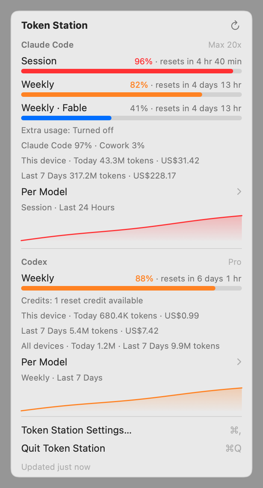

# Token Station

Token Station puts your Claude Code and OpenAI Codex plan usage in the Linux panel and
the macOS menu bar. You get session and weekly limits, reset countdowns, token counts
and API-equivalent cost, in a front end that looks like it shipped with your desktop.

| KDE Plasma 6 (system tray applet) | GNOME Shell (top-bar indicator) | macOS (menu bar extra) |
|---|---|---|
|  |  |  |

The tray icon is a small two-bar meter, one bar for Claude Code and one for Codex. Each
bar fills to the most constrained limit and changes colour when it crosses your warning
or critical threshold.


## How it works

```
 ~/.claude creds + logs ─┐                                  ┌─ Plasma tray applet (QML, Kirigami/PlasmaComponents)
 api.anthropic.com ──────┤                                  │
 statusline collector ───┼─> token-station daemon ─D-Bus────┼─ GNOME Shell extension (GJS/St, libadwaita prefs)
 codex app-server ───────┤   (Rust)                         │
 codex rollouts ─────────┘         │                        └─ token-station tray (StatusNotifierItem, other desktops)
                                   └─Unix socket (macOS)────── Token Station.app (SwiftUI menu bar extra)
```

A small Rust daemon is the only process that touches credentials, the network or log
files. It publishes one JSON snapshot on the session bus
(`dev.soldunov.TokenStation`, see [docs/dbus-api.md](docs/dbus-api.md)), or on macOS
over a Unix socket ([docs/socket-api.md](docs/socket-api.md)), and the front ends only
render it. [docs/architecture.md](docs/architecture.md) has the details.

### Claude Code

Plan limits come from the endpoint behind Claude Code's own `/usage` command, called with
the CLI's sign-in (on macOS, the one Claude Code keeps in your login Keychain). Token
Station only reads that token. It never refreshes, writes or logs it. If you turn on the optional statusline collector, Claude Code also sends its
official `rate_limits` statusline data straight to the daemon while it runs. Token counts
and cost come from the local transcripts in `~/.claude/projects`.

### Codex

The daemon starts `codex app-server` when it needs fresh numbers and lets the logged-in
CLI handle authentication. It reads `account/rateLimits/read` and `account/usage/read`,
then stops the child after a minute of idleness. Per-model token counts come from the
local rollout logs.

[docs/data-sources.md](docs/data-sources.md) lists the exact calls, says which ones are
undocumented, and explains what happens when one fails.

## Install

### Nix flake (home-manager)

```nix
# flake.nix inputs
token-station.url = "github:psoldunov/token-station";

# home-manager configuration
imports = [ inputs.token-station.homeManagerModules.default ];
programs.token-station = {
  enable = true;
  # gnome.enable = true;                  # enable the Shell extension via dconf
  # claudeStatusline = {                  # optional: live limits from Claude Code's statusline
  #   enable = true;
  #   wrap = "bash ~/.claude/statusline.sh";   # your existing statusline keeps rendering
  # };
  # settings.alerts.warning_percent = 75; # makes config.toml read-only (Nix-managed)
};
```

This installs the daemon as a supervised `systemd --user` service (also D-Bus
activatable), plus the Plasma applet and the GNOME extension. On Plasma the applet shows
up in the system tray by itself, in the running session too: the switch tells
plasmashell about it. On GNOME, enable the extension (or set `gnome.enable = true`)
and log in again.

The flake also has a NixOS module (`nixosModules.default`) and an overlay
(`overlays.default`). Neither tells a running plasmashell about the applet, so after
installing through them, log out and back in (or run
`systemctl --user restart plasma-plasmashell`) before looking for it in the tray. To
try it without installing anything, run
`nix run github:psoldunov/token-station -- status`.

If you install the package on its own, say with `nix profile install` or through the
overlay, you get the systemd user unit (`share/systemd/user/token-station.service`) and
the D-Bus activation file, but nothing enables the unit. You can leave that to D-Bus
activation, which the front ends trigger on their own, or enable it once yourself:

```sh
systemctl --user daemon-reload
systemctl --user enable --now token-station
```

The home-manager and NixOS modules, and the AppImage's `setup`, take care of this for you.

### AppImage

Download `TokenStation-x86_64.AppImage` from the releases page, then:

```sh
chmod +x TokenStation-x86_64.AppImage
./TokenStation-x86_64.AppImage              # same as `setup`
```

`setup` works out which desktop you are on and installs the matching front end into
`~/.local/share`. It registers the daemon as a systemd user unit with D-Bus activation
pointing at the AppImage. On desktops other than KDE and GNOME it also autostarts the
tray icon.

Everything `setup` creates goes into a manifest, and
`./TokenStation-x86_64.AppImage uninstall` removes exactly that. If you move the
AppImage, run `setup` again. On Plasma the applet appears in the system tray by itself,
without a new login: `setup` tells the running plasmashell about it, and `uninstall`
tells it the applet is gone.
GNOME on Wayland needs a fresh login before the extension shows up.

The flags you are most likely to want are `--dry-run`, `--desktop kde|gnome|other`,
`--claude-statusline` and `--force`. `--claude-statusline` wraps your existing Claude
Code statusline, and refuses if the settings file is managed by Nix. `--force` replaces
existing files that `setup` did not create, but it still never touches Nix-managed ones.

### macOS

Download `TokenStation-macOS.zip` from the releases page, unzip it and drag
**Token Station** into Applications. The app is not notarized, so macOS refuses the
first launch. Either click **Open Anyway** in System Settings → Privacy & Security
after that first attempt, or clear the quarantine flag once:

```sh
xattr -dr com.apple.quarantine "/Applications/Token Station.app"
```

Token Station lives in the menu bar and has no Dock icon. The app runs its own copy of
the daemon and stops it when you quit. **Open at Login** is in its Settings (⌘,).
Alerts arrive through Notification Center, and System Settings → Notifications →
Token Station controls how they look.

To build the app yourself you need Rust and Xcode. There is no Xcode project: a Swift
package and a script build the bundle. Xcode is still needed because SwiftUI's macros
ship only with it, and the script finds it through `xcode-select` or `DEVELOPER_DIR`:

```sh
frontends/macos/scripts/build-app.sh                    # frontends/macos/build/Token Station.app
frontends/macos/scripts/build-app.sh --universal --zip  # Apple silicon + Intel, zipped
```

The CLI ships inside the bundle. Link it into your `PATH` if you want it there:

```sh
ln -s "/Applications/Token Station.app/Contents/MacOS/token-station" ~/.local/bin/token-station
```

`setup`, `uninstall` and `tray` are Linux-only. To feed Claude Code's statusline to the
app, point `statusLine.command` in `~/.claude/settings.json` at
`token-station statusline` yourself, with `--wrap` for the statusline you already have.

## Requirements

- KDE Plasma 6.4 or newer, or GNOME Shell 46 to 50. Other desktops need a
  StatusNotifierItem host. On GNOME, only the tray fallback needs the AppIndicator
  extension; the native extension works without it.
- macOS 14 Sonoma or newer, on Apple silicon or Intel.
- For Claude Code plan limits, Claude Code signed in with a Pro or Max subscription.
  API-key users still get local token counts and cost.
- For Codex plan limits, the Codex CLI signed in with ChatGPT (`codex login`).

## CLI

```
token-station status [--json]     one-shot report (uses the daemon if it runs)
token-station refresh             ask the daemon to refresh now
token-station daemon [--fixture FILE] [--config FILE]
token-station statusline [--wrap CMD]   Claude Code statusLine collector
token-station tray                StatusNotifierItem icon for other desktops (Linux)
token-station setup | uninstall   AppImage desktop integration (Linux)
```

## Configuration

Settings live in `$XDG_CONFIG_HOME/token-station/config.toml`, or on macOS in
`~/Library/Application Support/dev.soldunov.TokenStation/config.toml`. Every key is
optional. The applet, extension and app settings pages edit the same file through the
daemon.

```toml
[general]
limits_interval_secs = 600    # plan-limit polling (120–86400)
tokens_interval_secs = 60     # local log scanning (>= 15)
history_retention_days = 35   # 1–366

[meter]
window = "most_constrained"   # most_constrained | session | weekly

[alerts]
warning_percent = 80          # 1–100, not above critical_percent
critical_percent = 95         # 1–100
notify = true                 # desktop notification when a threshold is crossed
notify_on_reset = false

[pricing]
auto_update = true            # refresh LiteLLM prices daily (a bundled table is the fallback)
url = "https://raw.githubusercontent.com/BerriAI/litellm/main/model_prices_and_context_window.json"  # must be https

[claude]
enabled = true
config_dir = ""               # default: $CLAUDE_CONFIG_DIR, else ~/.claude
binary = ""                   # default: discover `claude` on PATH and well-known directories
use_oauth_endpoint = true
user_agent = ""               # default: claude-code/<installed version>, like the CLI itself
min_endpoint_interval_secs = 300   # shortest gap between two endpoint calls (>= 120)

[codex]
enabled = true
binary = ""                   # default: discover `codex` on PATH and well-known directories
homes = []                    # default: $CODEX_HOME, else ~/.codex
process_mode = "on_demand"    # on_demand | persistent
linger_secs = 60              # idle seconds before the app-server child stops (<= 3600)
http_fallback = true
```

The daemon rejects unknown keys, so a typo fails loudly instead of being quietly ignored.

## Development

```sh
nix develop                                   # Rust, Plasma SDK, gjs, qmllint, llvm-cov
cargo test --workspace
cargo clippy --workspace --all-targets        # clippy::pedantic via [workspace.lints]
cargo deny check && cargo machete             # licences, bans, sources, advisories; unused deps
cargo run -p token-station -- daemon --fixture data/fixtures/snapshot-near-limit.json
plasmoidviewer -a frontends/plasma/dev.soldunov.tokenstation
bash frontends/plasma/tests/render.sh         # offscreen renders of every fixture
nix build -L .#checks.x86_64-linux.gnome-vm   # boots GNOME, loads the extension, screenshots
nix flake check                               # clippy, tests, fmt, deny, machete, packages, VM test
nix build .#appimage                          # static musl AppImage (CI builds it on master only)
```

CI substitutes from the public `psoldunov` Cachix cache, so a check already built for the
same sources is not built again. Run the checks on the commit you are about to push and
push the results, and CI's `nix flake check` only downloads them (needs `cachix authtoken`
once):

```sh
cachix watch-exec psoldunov -- nix flake check -L
```

Fixture mode serves `data/fixtures/*.json` with live countdowns, synthetic history and
in-memory settings, so you can work on the front ends without real accounts.

On macOS, the daemon's own tests run with plain `cargo test --workspace`, and the app's
build, tests, SwiftLint, Periphery and offscreen renders are described in
[frontends/macos/README.md](frontends/macos/README.md):

```sh
cargo run -p token-station -- daemon --fixture data/fixtures/snapshot-near-limit.json &
cd frontends/macos && swift test && swift run TokenStation   # connects to that daemon
```

## License

MIT
