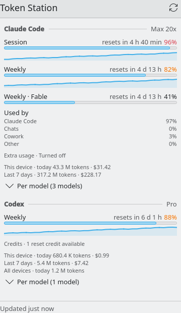
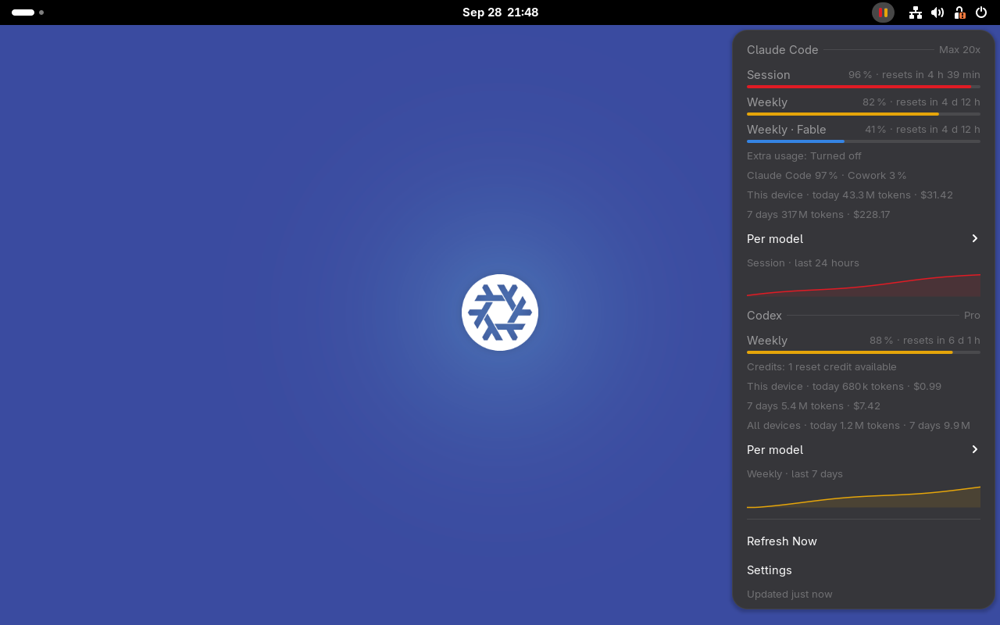
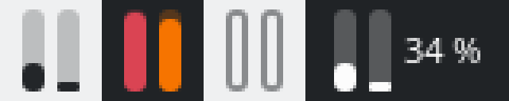

# Token Station

Claude Code and OpenAI Codex plan usage in your Linux panel — session and weekly
limits, reset countdowns, token counts and API-equivalent cost — with a front end that
looks like it shipped with your desktop.

| KDE Plasma 6 (system tray applet) | GNOME Shell (top-bar indicator) |
|---|---|
|  |  |

The tray icon is a dual mini-meter: one bar for Claude Code, one for Codex, filled to
the most constrained limit and tinted when it crosses your warning/critical thresholds.



## How it works

```
 ~/.claude creds + logs ─┐                                ┌─ Plasma tray applet (QML, Kirigami/PlasmaComponents)
 api.anthropic.com ──────┤                                │
 statusline collector ───┼─> token-station daemon ─D-Bus──┼─ GNOME Shell extension (GJS/St, libadwaita prefs)
 codex app-server ───────┤   (Rust)                       │
 codex rollouts ─────────┘                                └─ token-station tray (StatusNotifierItem, other desktops)
```

A small Rust daemon is the only process that touches credentials, the network or log
files. It publishes one JSON snapshot on the session bus
(`dev.soldunov.TokenStation`, see [docs/dbus-api.md](docs/dbus-api.md)); the desktop
front ends only render it. Details: [docs/architecture.md](docs/architecture.md).

**Claude Code** — plan limits come from the same endpoint Claude Code's `/usage` uses,
called with the CLI's own sign-in (read-only: the token is never refreshed, written or
logged). While Claude Code runs, the optional statusline collector feeds the official
`rate_limits` statusline data straight to the daemon. Token counts and cost come from
the local transcripts in `~/.claude/projects`.

**Codex** — the daemon starts `codex app-server` on demand (the logged-in CLI does all
authentication), reads `account/rateLimits/read` and `account/usage/read`, and stops the
child after a minute of idleness. Local rollout logs provide per-model token counts.

See [docs/data-sources.md](docs/data-sources.md) for the exact calls, what is
undocumented, and how failures degrade.

## Install

### Nix flake (home-manager)

```nix
# flake.nix inputs
token-station.url = "github:psoldunov/token-station";

# home-manager configuration
imports = [ inputs.token-station.homeManagerModules.default ];
programs.token-station = {
  enable = true;
  # gnome.enable = true;                  # enable the Shell extension via dconf
  # claudeStatusline = {                  # optional: live limits from Claude Code's statusline
  #   enable = true;
  #   wrap = "bash ~/.claude/statusline.sh";   # your existing statusline keeps rendering
  # };
  # settings.alerts.warning_percent = 75; # makes config.toml read-only (Nix-managed)
};
```

This installs the daemon as a supervised `systemd --user` service (also D-Bus
activatable), the Plasma applet and the GNOME extension. On Plasma the applet appears in
the system tray automatically; on GNOME enable the extension (or set
`gnome.enable = true`) and log in again.

A NixOS module (`nixosModules.default`) and an overlay (`overlays.default`) are
available too; `nix run github:psoldunov/token-station -- status` works without installing.

Installing the package on its own — `nix profile install`, the overlay, or any
packaging that just puts the files in a profile — gives you the systemd user unit
(`share/systemd/user/token-station.service`) and the D-Bus activation file, but nothing
enables the unit. Either let D-Bus activate it (the front ends do that on their own), or
start it yourself once:

```sh
systemctl --user daemon-reload
systemctl --user enable --now token-station
```

The home-manager and NixOS modules, and the AppImage's `setup`, do this for you.

### AppImage

Download `TokenStation-x86_64.AppImage` from the releases page, then:

```sh
chmod +x TokenStation-x86_64.AppImage
./TokenStation-x86_64.AppImage              # same as `setup`
```

`setup` detects your desktop and installs the matching front end into
`~/.local/share`, registers the daemon (systemd user unit + D-Bus activation pointing at
the AppImage) and, on desktops other than KDE/GNOME, autostarts the tray icon. Useful
flags: `--dry-run`, `--desktop kde|gnome|other`, `--claude-statusline` (wraps your
existing Claude Code statusline; refuses Nix-managed settings files) and `--force`
(replace existing files that `setup` did not create; Nix-managed files are never
replaced). Everything it creates is recorded, and
`./TokenStation-x86_64.AppImage uninstall` removes exactly that. Re-run `setup` after
moving the file. On Plasma the applet appears in the system tray on its own; GNOME on
Wayland needs a re-login before the extension shows up.

## Requirements

- KDE Plasma ≥ 6.4 or GNOME Shell 46–50 (other desktops: any StatusNotifierItem host; on
  GNOME the tray fallback needs the AppIndicator extension, the native extension does not).
- Claude Code signed in with a Pro/Max subscription for plan limits (API-key users still
  get local token counts and cost).
- Codex CLI signed in with ChatGPT for plan limits (`codex login`).

## CLI

```
token-station status [--json]     one-shot report (uses the daemon if it runs)
token-station refresh             ask the daemon to refresh now
token-station daemon [--fixture FILE] [--config FILE]
token-station statusline [--wrap CMD]   Claude Code statusLine collector
token-station tray                StatusNotifierItem icon for other desktops
token-station setup | uninstall   AppImage desktop integration
```

## Configuration

`$XDG_CONFIG_HOME/token-station/config.toml` — every key is optional; the applet and
extension settings pages edit the same file through the daemon.

```toml
[general]
limits_interval_secs = 300    # plan-limit polling (120–86400)
tokens_interval_secs = 60     # local log scanning (>= 15)
history_retention_days = 35   # 1–366

[meter]
window = "most_constrained"   # most_constrained | session | weekly

[alerts]
warning_percent = 80          # 1–100, not above critical_percent
critical_percent = 95         # 1–100
notify = true                 # desktop notification when a threshold is crossed
notify_on_reset = false

[pricing]
auto_update = true            # refresh LiteLLM prices daily (a bundled table is the fallback)
url = "https://raw.githubusercontent.com/BerriAI/litellm/main/model_prices_and_context_window.json"  # must be https

[claude]
enabled = true
config_dir = ""               # default: $CLAUDE_CONFIG_DIR, else ~/.claude
binary = ""                   # default: discover `claude` on PATH and well-known directories
use_oauth_endpoint = true
user_agent = ""               # default: claude-code/<installed version>, like the CLI itself
min_endpoint_interval_secs = 180   # shortest gap between two endpoint calls (>= 120)

[codex]
enabled = true
binary = ""                   # default: discover `codex` on PATH and well-known directories
homes = []                    # default: $CODEX_HOME, else ~/.codex
process_mode = "on_demand"    # on_demand | persistent
linger_secs = 60              # idle seconds before the app-server child stops (<= 3600)
http_fallback = true
```

Unknown keys are rejected, so a typo fails loudly instead of being ignored.

## Development

```sh
nix develop                                   # Rust, Plasma SDK, gjs, qmllint, llvm-cov
cargo test --workspace
cargo clippy --workspace --all-targets        # clippy::pedantic via [workspace.lints]
cargo deny check && cargo machete             # licences, bans, sources, advisories; unused deps
cargo run -p token-station -- daemon --fixture data/fixtures/snapshot-near-limit.json
plasmoidviewer -a frontends/plasma/dev.soldunov.tokenstation
bash frontends/plasma/tests/render.sh         # offscreen renders of every fixture
nix build -L .#checks.x86_64-linux.gnome-vm   # boots GNOME, loads the extension, screenshots
nix flake check                               # clippy, tests, fmt, deny, machete, packages, VM test
nix build .#appimage                          # static musl AppImage
```

Fixture mode serves `data/fixtures/*.json` with live countdowns, synthetic history and
in-memory settings, so front ends can be developed without real accounts.

## License

MIT
